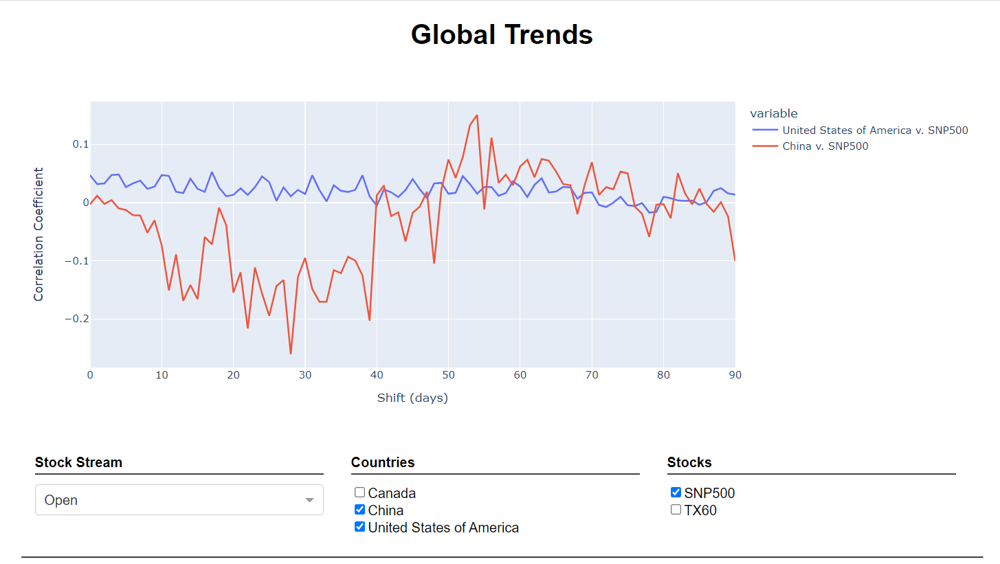
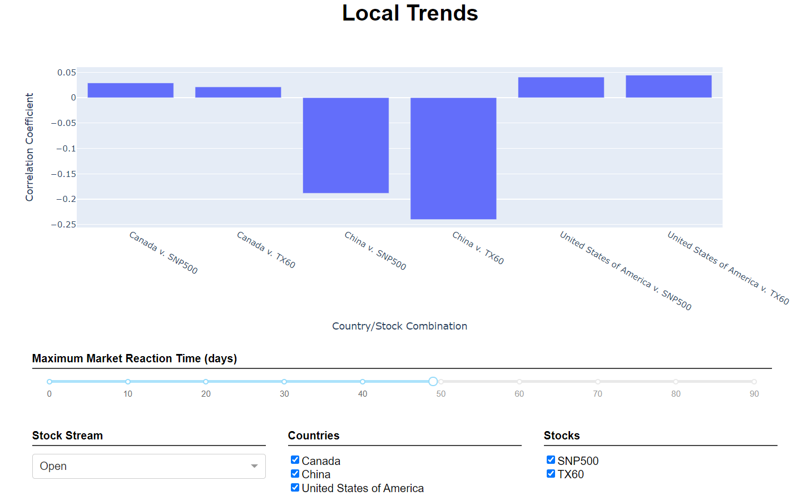

# COVID-19 Economics

After the start of the COVID-19 pandemic, the S&P500, generally considered a reliable market indicator, experienced its sharpest decline since the housing market crash in 2008.
This poses the question:

> To what degree do changes in COVID-19 case numbers in Canada, the United States and China correlate to changes in the Canadian and American economy as measured by change in stock indices?

To answer this question, two separate analyses were done on an appropriate dataset, each with their own underlying assumptions.
We have dubbed the two analyses 'global' and 'local'.

**Note:** for usage instructions and a more complete description of this project (+ references) see [project_report.pdf](project_report.pdf).

## Global Trends

For the global trend analysis, we assumed that the reaction time between COVID-19 data and stock data is equal.
Because of this, we can calculate (and graph) the correlation coefficient between the COVID-19 data and the stock data shifted between 0 and 90 days.

Under these assumptions, if there is a direct correlation between COVID-19 data and stock market data, we expect to see the graph spike to a statistically significant value at a single point (which would be the reaction time).

Overall this method provides no evidence that there is a direct relationship between COVID-19 data and stock market price changes.

## Local Trends

For the local trend analysis, we assumed that the reaction time between COVID-19 data spikes and stock data spikes is at most some number of days.
We defined a spike as any change whose magnitude is larger than the magnitude of the average change, with all 0 changes dropped.
Then we try to match COVID-19 spikes with what we think would be the relevant stock spikes, and find the correlation coefficient of that data.

Under these assumptions, if there is a direct correlation between COVID-19 data and stock market data, we expect to see statistically significant values for at least a single value of the maximum market reaction time.

Overall this method provides no evidence that there is a direct relationship between COVID-19 data and stock market price changes.

## Copyright

The entirety of this project is Copyright (C) 2021, Theodore Preduta and Jacob Kolyakov.
All rights reserved.

*Remember that public source is not the same as open source :-).*
